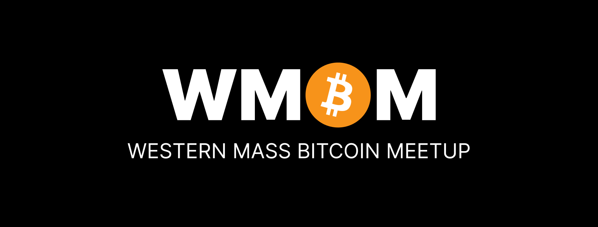

  
  
Western Mass Bitcoin Meetup #43

  
Mar. 2026

---
layout: none
---

  

    
    

      
      
Listen on Fountain

    

    

      
      
bugle.news

    

  

  

    

      
Podcast Spotlight

      <h1 class="podcast-title">The Bugle Weekly</h1>
      
Richard Greaser & Rod Palmer

    

    <blockquote class="podcast-quote">
      "It's like the 753rd funniest account on Twitter" — @udiwertheimer
    </blockquote>
    <ul class="podcast-bullets">
      <li>Launched in Jan. 2023 by Richard Greaser — in a parallel dimension where the Bugle rivals the NYT and WSJ. A glitch in the matrix lets you glimpse it.</li>
      <li>In your dimension the stories appear absurd. In theirs, they're front-page news.</li>
      <li>Zero corporate sponsorships — by design. When you take sponsor money, the audience becomes the product. The Bugle refuses that deal.</li>
      <li>The world's most thermodynamically sound Bitcoin podcast — credentialed journalists, 40HPW of listening, chain smoking included.</li>
    </ul>
  

